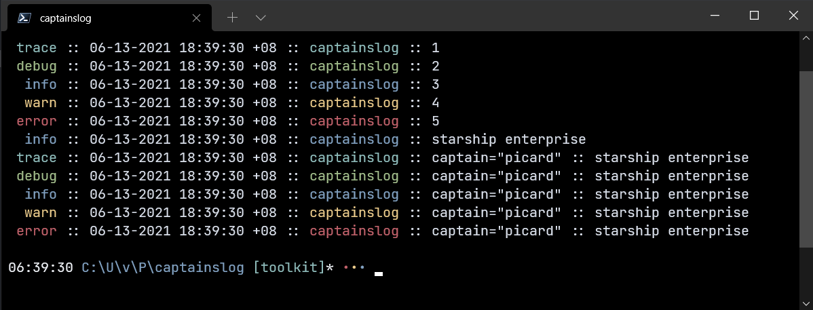

# Captain's Log

[](https://github.com/vincentfiestada/captainslog/actions?query=workflow%3A%22Unit+Tests%22)
[](https://github.com/vincentfiestada/captainslog/actions?query=workflow%3A%22Style+Checks%22)
[](https://pkg.go.dev/github.com/vincentfiestada/captainslog/v2?tab=doc)
[](https://conventionalcommits.org)
[](./license)

A simple logging library for [Go](https://golang.org/)

- cross-platform colors
- multiple log levels
- structured logging
- caller detection



## Installation

```
go get github.com/vincentfiestada/captainslog/v2
```

## Usage

This library is designed to provide a familiar yet powerful interface for logging. Each logging method accepts a format string and arguments. Structured logging is supported right out of the box. The Logger allows you to turn colors on/off, specify a datetime format, set the logging threshold, and even provide your own function to control how logs are written.

```go
package main

import (
	"github.com/vincentfiestada/captainslog/v2"
)

var log = captainslog.NewLogger()

func main() {

	log.Trace("this is %s", "captainslog")
	log.Debug("this is %s", "captainslog")
	log.Info("this is %s", "captainslog")
	log.Warn("this is %s", "captainslog")
	log.Error("this is %s", "captainslog")

	log.Fields(

		log.I("captain", "picard"),
		log.I("first officer", "riker"),
		log.I("science officer", "data"),
		log.I("medical officer", "crusher"),
		log.I("chief engineer", "la forge"),
		log.I("security officer", "worf"),

	).Info("starship enterprise")

}
```

## Format

There are several [log formats](./docs/format.md) included that you can choose from. It's also easy to write your own custom function to print logs just the way you want to.

## Performance

The main goals of this library are convenience and familiarity for programmers, but it should have reasonable performance for most projects. To see for yourself, run the benchmarks using `./tools benchmark`.

## Development

Please read the [Contribution Guide](./CONTRIBUTING.md) before you proceed. This project uses [tools](https://vincent.click/toolkit) that run on [Powershell Core](https://microsoft.com/PowerShell). To get started,

```ps1
./tools help
```

## Copyright

Copyright 2019-2021 [Vincent Fiestada](mailto:vincent@vincent.click). This project is released under a [BSD-3-Clause License](./license).

Icon made by [Freepik](http://www.freepik.com/).
