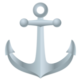
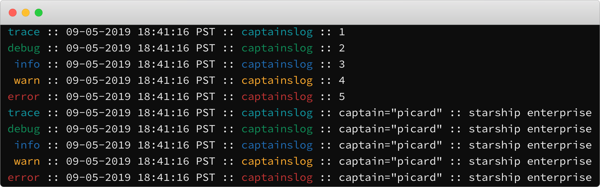

# Captain's Log

[](https://vincentofearth.visualstudio.com/captainslog/_build/latest?definitionId=5&branchName=dev)
[](https://goreportcard.com/report/github.com/vincentfiestada/captainslog)
[](https://godoc.org/github.com/vincentfiestada/captainslog)
[](https://conventionalcommits.org)
[](https://github.com/vincentfiestada/captainslog/blob/master/LICENSE)

A simple logging library for [Go](https://golang.org/).

- Support for multiple logging levels
- Colored output, even on Windows
- Print the calling function name
- Enables structured logging



## Usage

```go
package main

import (
	"math"

	"github.com/vincentfiestada/captainslog"
)

var log *captainslog.Logger

func main() {
	log.Info("π = %v", math.Pi)
}

func init() {
	log = captainslog.NewLogger()
}

```

The logging levels supported, in decreasing order of priority, are Fatal, Error, Warn, Info, Debug, and Trace.

## Development

This project uses [Task runner](https://taskfile.dev/). List all available tasks by running `task -l`. To get started, run:

```
task install
```

<small>Gopher artwork by [Ashley McNamara](https://twitter.com/ashleymcnamara) on [Gopherize.me](https://gopherize.me/gopher/5dcbe4dc48ab6fbf903aae352f8742cb59e7099b)</small>
