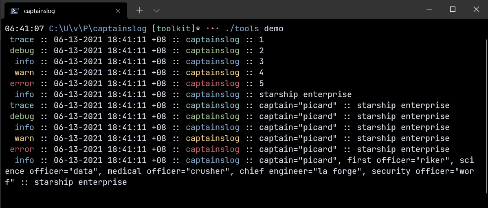
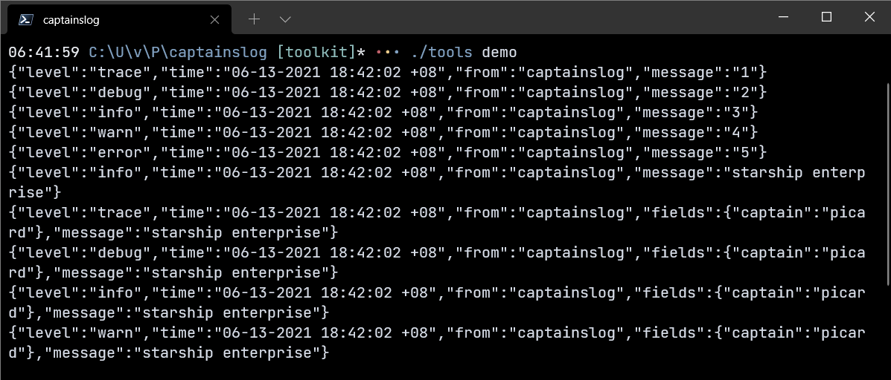
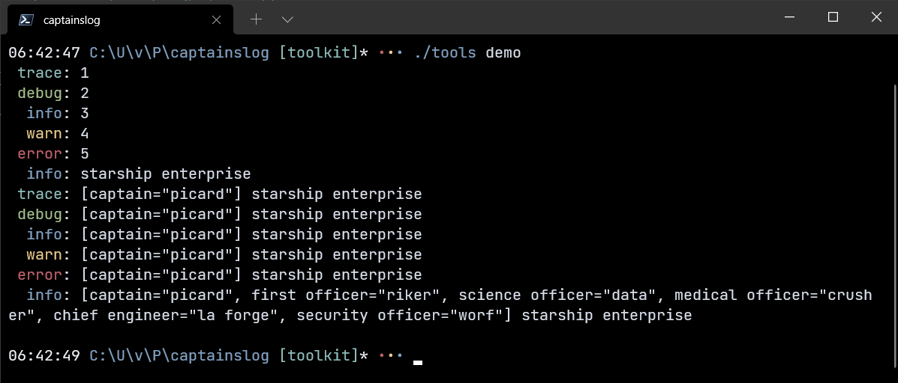

# Log Format

A `msg.Format` is any function that can format and print a log message. The `format` package includes a few of these, described below.

## Flat (default)

Flat is the default log format, and prints a single line of text which includes the message, timestamp, name of the logger or the current function, fields, and the message text. This format is a good place to start for most long-running applications.

## JSON

JSON prints each log as a JSON object, making them easier to parse and analyze at scale. This format is useful if you plan to use tools like the [Elastic Stack](https://www.elastic.co/log-monitoring) to monitor your application's activity.

## Minimal

This minimalist log format ignores the timestamp and current function name. This is useful for small command-line tools that need to print messages without too much ceremony.

